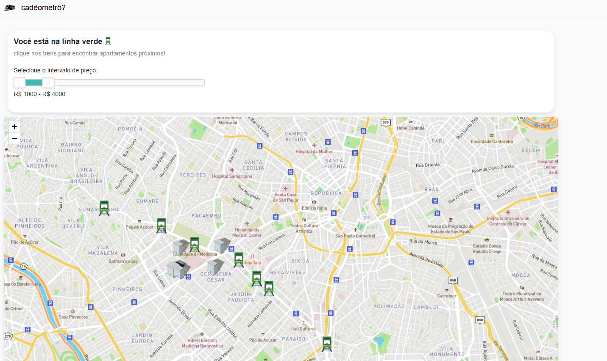

# 🏙️ Cadeômetro

Aplicação Flask para visualizar moradias disponíveis no QuintoAndar próximas a estações de metrô de São Paulo.

## 📸 Prints

### Página inicial


### Mapa com estações e imóveis


> 📌 Coloque suas imagens na pasta `images/` do repositório e use esse mesmo nome. Ou, se estiver usando links externos, troque o caminho da imagem.

---

## 🚀 Tecnologias

- Python 3
- Flask
- Pandas
- HTML + Jinja2
- QuintoAndar API não oficial

---

## 🔧 Como rodar localmente

1. Clone o repositório:
```bash
git clone https://github.com/seu-usuario/cadeometro.git
cd cadeometro
```

2. Instale as dependências:
```bash
pip install -r requirements.txt
```

3. Execute o app:
```bash
python app.py
```

4. Acesse via navegador:
```
http://localhost:5000
```

---

## 📂 Estrutura básica

```
.
├── app.py
├── preprocess/
│   └── base_estacoes.csv
├── src/
│   └── buildings/
│       ├── build_lister_quinto_andar.py
│       ├── build_getter_quinto_andar.py
│       └── building.py
├── templates/
│   ├── index.html
│   └── map.html
└── static/
    └── (seus arquivos de estilo e JS, se houver)
```

---

## 🙋‍♂️ Sobre

Projeto feito por Neto Figueira e Eduardo Dias Vicentini com o objetivo de facilitar a busca por moradia próxima ao metrô em SP.  
Contribuições são bem-vindas!